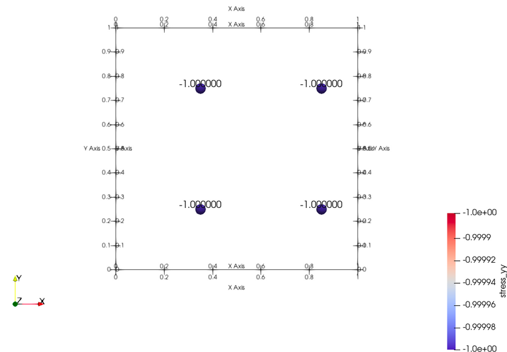

# Google Summer of Code 2023 Report

## The Project: Differential Programming in Material Point Method

Brief summary of  [the
project](https://summerofcode.withgoogle.com/programs/2023/projects/RZJ09HkH) is as follows:

In this project we are building a new library implementing the Material Point Method. The Material Point Method is a computational technique used in solid mechanics and fluid dynamics to simulate the behaviour of materials undergoing large deformation.  

The primary objectives of the library is to provide the support for backward differentiation which will help in solving inverse problems. The library is based on the [C++ Implementation](https://github.com/cb-geo/mpm) of the method. The C++ Implementation does not have support for inverse problem solving. The library is being developed in JAX to efficiently utilize modern GPUs to accelerate MPM simulations.  

## What is Differential Programming?  

Differentiable programming is a paradigm that allows us to seamlessly integrate traditional programming and differentiable calculus, opening up exciting opportunities for optimization, sensitivity analysis, and more. Unlike conventional programming, where code execution follows explicit instructions, differentiable programming enables the calculation of gradients of functions with respect to their inputs. This characteristic is particularly powerful in scenarios where optimization is key, as gradients provide crucial information about how small changes in inputs affect the output.  
Differential Programming has many applications in scientific computing, it is used to solve inverse problems, probabilistic programming. Differentiable programming creats a computational graph of the program and when the backward pass is called it calculates gradient at each node of the computational graph by chain rule. A sample computational graph:

*Image Source: [Paperspace](https://blog.paperspace.com/pytorch-101-understanding-graphs-and-automatic-differentiation/)*

The gradient of the input is thus calculated with respect to the loss L and thus we can apply gradient based optimisation methods to minimise the loss and find the appropriate parameters.  

## What is Material Point Method?

Material Point Method (MPM) is a numerical method which is used in simulation of interaction of bodies under various conditions. This mathod is a particle based method that represents the material as a collection of material points. This method is highly effective in the context of large body deformations. There are various drawbacks of the Finite Element Method (FEM) which are overcome by MPM. The main drawback of FEM is that it is not much effective in large deformations due to mesh distortion, which is addressed by MPM by having a fixed mesh and moving the material points.  

The MPM can be divided into 4 major steps mapping the particles to the node, finding the solution at the nodal points, mapping the nodal solution back to the particles, updating the particles.

*Image Source: [CB-Geo](https://www.cb-geo.com/research/mpm/)*

## Inverse Problems and Applications

Inverse problems play a pivotal role in scientific computing by unraveling hidden information from observed data. These problems involve inferring the causes or parameters of a system based on its observable outcomes. In scientific computing, they find applications across diverse fields, such as medical imaging, geophysics, and engineering simulations.  

Using this library we can find the input material properties by iteratively updating the input material properties and minimizing the loss function which is the norm of the expected output and the actual output. Diff-MPM is a novel tool which can provide gradient information and can be used along with existing ML algorithms to generate optimization in robotics.

Following is an example of inverse problem solving using Diff-MPM:

## The Work

In the initial part of the period I developed a deeper understanding of the Material Point Method, Automatic Differentiation, JAX, Taichi Lang and tried to code the 1-Dimensional version of the Material Point Method in [Taichi Lang](https://github.com/SachinJalan/diffmpm-taichi). We were successful in running a simple forward solver and inverse solver in Taichi.

[Taichi](https://www.taichi-lang.org/) is a modern programming language designed for high-performance numerical computing. Its unique features, such as support for automatic differentiation, GPU acceleration, and explicit parallelism, make it a good choice for implementing complex simulations like the differentiable MPM.

Having implemented example the method in Taichi lang I developed better understanding in the diff MPM method. In the later part of the program I worked along with the mentors in developing the diff-MPM library in JAX.

### Repositories

<https://github.com/geoelements/diffmpm>

### Pull Requests

| Pull Request                                                                                                                                          | Commit                                                                                                            | Status     | Description                                                                                                                                                                                                                                                                                                                                                                                                                                                                                                                          |
| ----------------------------------------------------------------------------------------------------------------------------------------------------- | ----------------------------------------------------------------------------------------------------------------- | ---------------- | ------------------------------------------------------------------------------------------------------------------------------------------------------------------------------------------------------------------------------------------------------------------------------------------------------------------------------------------------------------------------------------------------------------------------------------------------------------------------------------------------------------------------------------ |
| [Added support for bingham material](https://github.com/geoelements/diffmpm/pull/13)                                                           | [1607646](https://github.com/geoelements/diffmpm/pull/13/commits/16076465b36e0a5b67c1ff8b92b356a4847511e7) |    | Extended the support for the types of material used in simulation, enabling simulations based on bingham material.                                                                                                                                                                                                                                                                                                                                                                                              |
| [Support for VTK Writer](https://github.com/geoelements/diffmpm/pull/29) | [75f8d35](https://github.com/geoelements/diffmpm/pull/29/commits/75f8d35133bdbad02d9de29c8328b1e442b183ba) |    | Added functionality for VTK Writer which enables visualisation of the simulations on Paraview and other softwares, created visualisations for various benchmarks.                                                                                                                                                                                                                                                                                                                          |
| [Addition of various utility functions for benchmarks](https://github.com/geoelements/diffmpm/pull/26) | [d2050fb](https://github.com/geoelements/diffmpm/pull/26/commits/d2050fbed8d6432046967234a51c6a162a5a54dc) |   | Implemented Utility functions which help in creating the input files for the diff-MPM library by converting the input files for the [CB-Geo benchmarks](https://github.com/cb-geo/mpm-benchmarks). |
| [Addition of inverse problem examples.](https://github.com/geoelements/diffmpm/pull/30)                                       | [4916f73](https://github.com/geoelements/diffmpm/pull/30/commits/4916f731bb9e824f5a841eb4da8302b178908f38) |   | Examples for 2-dimension inverse problem solver on diff-MPM library added using various types of algorithms like ADAM and Bayesian Optimization, made the inverse problem solver much faster.               |
[Generated input files for 2-D Plate with hole example](https://github.com/geoelements/diffmpm/pull/28)                                       | [4d4466a](https://github.com/geoelements/diffmpm/pull/28/commits/4d4466ac334fe85dd1d4421d8ec2a54f3bbf9a0b) |   | Generated input files for simulating a stress on a 2-D plate with a hole. The configuration file were generated in TOML and JSON. The configuration file was dervied from the [CB-Geo benchmarks](https://github.com/cb-geo/mpm-benchmarks) repository.            |

## Results

Following are few examples simulated from the diff-MPM library and visualised in Paraview:

### Uniaxial Stress

In this example stress is applied to a body simulated by a set of particles and stress is measured on the particles. Following is the analysis of stress on the body simulated by the diff-MPM library:

### Uniaxial Particle Traction

In this example traction is applied to a body simulated by a set of particles and stress is measured on the particles. Following is the analysis of stress on the body simulated by the diff-MPM library:

### Uniaxial Nodal Forces

In this example nodal forces are applied to node 0 and MPM simulation is run on it. Following is the analysis of stress on the body simulated by the diff-MPM library:

## Acknowledgements

I would like to thank the mentors, [Krishna Kumar](https://github.com/kks32) and [Chahak Mehta](https://github.com/chahak13), for their support and guidance, I have learned so much in the past few months from them which I would not have been able to learn on my own.

## Profiles

GitHub: <https://github.com/SachinJalan>

LinkedIn: <https://www.linkedin.com/in/sachin-jalan-591a40228/>